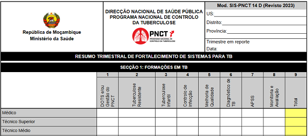

# Totalizador de Resumo Trimestral de Fortalecimento de Sistemas para TB

O **Totalizador de Resumo Trimestral de Fortalecimento de Sistemas para TB** é um serviço online gratuito que auxilia na elaboração do resumo trimestral de fortalecimento de sistemas para TB com base nos dados inseridos pelo usuário. Foi desenvolvido de acordo com o modelo da respectiva ficha de resumo trimestral actualmente vigente no Serviço Nacional de Saúde em Moçambique.

## Objectivos

* Auxiliar os Profissionais de Saúde na totalização do resumo trimestral de fortalecimento de sistemas para TB com exatidão e prontidão;

* Minimizar possíveis erros de totalização (por exemplo, somar involuntariamente células não correspondentes ou registar o total da linha A, na linha B);

* Expandir o acesso à ficha de resumo trimestral de fortalecimento de sistemas para TB.

## O que eu preciso dispor para, e como utilizar o totalizador?

* Um celular ou computador com acesso à internet;

* Ter colhido os dados de todos os indicadores da ficha nas respectivas fontes primárias (livro(s) de registo) da sua Unidade Sanitária;

* E por fim, preencher os dados nas células correspondentes em função das variáveis (indicador, faixa etária e sexo) e consequentemente os respectivos totais são, em tempo real, correcta e automaticamente calculados.

>[!NOTE]
>
> O totalizador garante um resumo trimestral correctamente totalizado, contudo, um resumo trimestral de qualidade não se limita apenas à uma correcta totalização. Factores não dependentes do totalizador como preenchimento correcto dos livros de registo, colheita de dados abrangente a todas as fontes primárias (livros de registo) com informação do trimestre em reporte, concordância de dados, entre outros, influenciam sobremaneira na qualidade de um resumo trimestral.

## Qual é o destino dos dados que eu insiro?

São guardados no seu celular ou computador, por meio de um recurso chamado [Web Storage](https://developer.mozilla.org/pt-BR/docs/Web/API/Web_Storage_API) e você tem total controle sobre os dados, podendo mantê-los ou apagá-los por meio da opção "Esvaziar ficha" no menu do totalizador ou excluindo os dados de navegação do seu navegador.

## Vantagens do totalizador

* Calcula automaticamente os totais;

* Preenche automaticamente as células correspondentes aos totais;

* Fornece resultados (totais) exactos;

* Flexibiliza a elaboração do resumo;

* Pode ser impresso, inclusíve como uma simples ficha de resumo trimestral;

* Pode ser guardado como PDF.

## Limitações do totalizador

* Não alerta sobre discrepância de dados, portanto, a análise da concordância dos dados é inteiramente dependente do usuário.